# Markdown Links

## 1. Resumen del proyecto

Se creó una API en este proyecto que tiene la capacidad de leer los enlaces dentro de un archivo MD. Luego se utilizó esta API en una aplicación CLI (interfaz de línea de comandos) para obtener información adicional sobre cada uno de los enlaces en el archivo MD. La librería está disponible para su descarga a través del comando "npm install".

## 2. Objetivos de aprendizaje
### JavaScript

- [x] **Diferenciar entre tipos de datos primitivos y no primitivos**
- [x] **Arrays (arreglos)**
- [x] **Objetos (key, value)**
- [x] **Uso de condicionales (if-else, switch, operador ternario, lógica booleana)**
- [x] **Funciones (params, args, return)**
- [x] **Recursión o recursividad**
- [x] **Módulos de CommonJS**
- [x] **Diferenciar entre expresiones (expressions) y sentencias (statements)**
- [x] **Callbacks**
- [x] **Promesas**
- [x] **Pruebas unitarias (unit tests)**
- [x] **Pruebas asíncronas**
- [x] **Uso de mocks y espías**
- [x] **Pruebas de compatibilidad en múltiples entornos de ejecución**
- [x] **Uso de linter (ESLINT)**
- [x] **Uso de identificadores descriptivos (Nomenclatura y Semántica)**
### Node.js

- [x] **Instalar y usar módulos con npm**
- [x] **Configuración de package.json**
- [x] **Configuración de npm-scripts**
- [x] **process (env, argv, stdin-stdout-stderr, exit-code)**
- [x] **File system (fs, path)**
### Control de Versiones (Git y GitHub)

- [x] **Git: Instalación y configuración**
- [x] **Git: Control de versiones con git (init, clone, add, commit, status, push, pull, remote)**
- [x] **Git: Integración de cambios entre ramas (branch, checkout, fetch, merge, reset, rebase, tag)**
- [x] **GitHub: Creación de cuenta y repos, configuración de llaves SSH**
- [x] **GitHub: Colaboración en Github (branches | forks | pull requests | code review | tags)**
- [x] **GitHub: Organización en Github (projects | issues | labels | milestones | releases)**
### HTTP

- [x] **Consulta o petición (request) y respuesta (response).**
- [x] **Códigos de status de HTTP**

## 4. Diagrama de flujo

Para este proyecto realicé un diagrama de flujo donde se muestra el flujo de API y CLI:
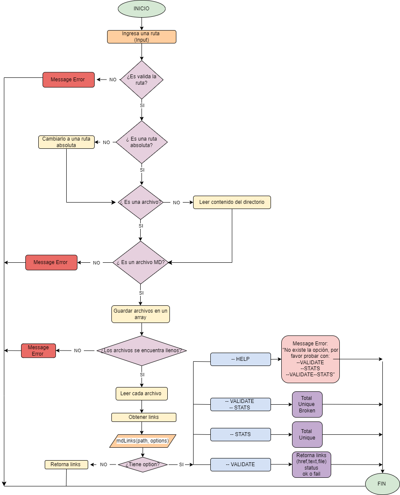  
## 5. Planificacion en GitHub project

El proyecto duró 5 sprints:

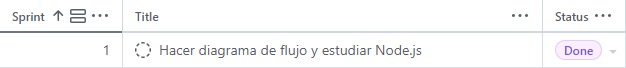 

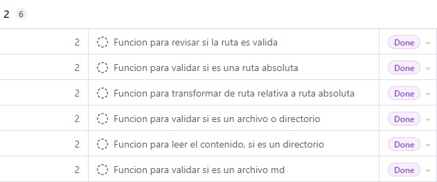 

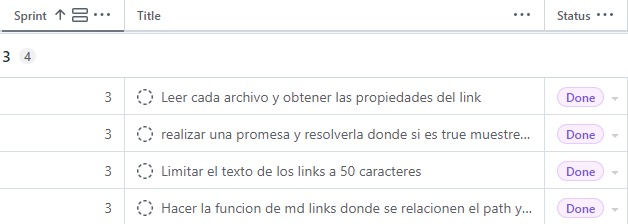 

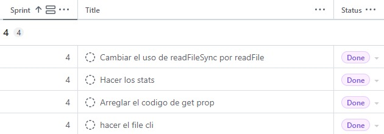 

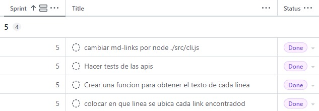 

## 6. Documentanción técnica de la libreria
### 1) Interfaz API
#### `mdLinks(path, options)`
##### Argumentos

* `path`: Ruta **absoluta** o **relativa** al **archivo** o **directorio**.
Si la ruta pasada es relativa, debe resolverse como relativa al directorio
desde donde se invoca node - _current working directory_).
* `options`: Un objeto con **únicamente** la siguiente propiedad:
  - `validate`: Booleano que determina si se desea validar los links
    encontrados.

##### Valor de retorno

Con `validate:false` :

* `href`: URL encontrada.
* `text`: Texto que aparecía dentro del link (`<a>`).
* `file`: Ruta del archivo donde se encontró el link.
* `lines`: Array de lineas que tiene el archivo.

#### Ejemplo

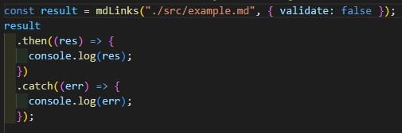 
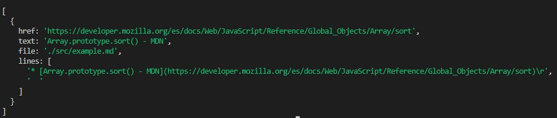 

Con `validate:true` :

* `href`: URL encontrada.
* `text`: Texto que aparecía dentro del link (`<a>`).
* `file`: Ruta del archivo donde se encontró el link.
* `status`: Código de respuesta HTTP.
* `lines`: Número de linea en la que se ubica el link.
* `ok`: Mensaje `fail` en caso de fallo u `ok` en caso de éxito.

#### Ejemplo

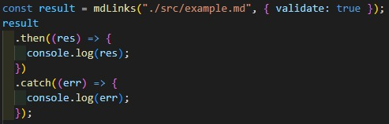 
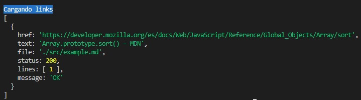

### 2) CLI (Command Line Interface - Interfaz de Línea de Comando)

El ejecutable de la aplicación se ejecuta de la siguiente
manera a través de la **terminal**:

`md-links <path-to-file> [options]`

Por ejemplo:

```sh
$ md-links demo.md
```
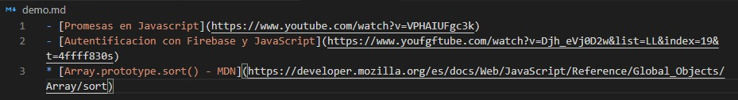 

El comportamiento por defecto valida si las URLs responden ok o no,
solo debe identificar el archivo markdown (a partir de la ruta que recibe como
argumento), analiza el archivo Markdown e imprime los links que vaya
encontrando, junto con la ruta del archivo donde aparece y el texto
que hay dentro del link (truncado a 50 caracteres).

#### Options

##### `--validate`

Si pasamos la opción `--validate`, el módulo debe hacer una petición HTTP para
averiguar si el link funciona o no. Si el link resulta en una redirección a una
URL que responde ok, entonces consideraremos el link como ok.

Por ejemplo:

```sh
$ md-links demo.md --validate
```
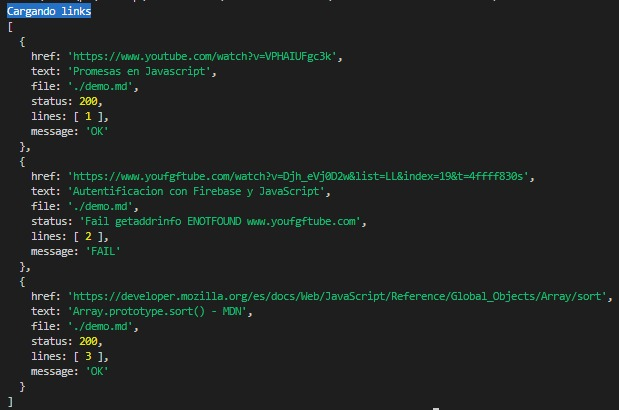

Vemos que el _output_ en este caso incluye la palabra `ok` o `fail`, así como el 
status de la respuesta recibida a la petición HTTP a dicha
URL y en que linea se ubica.

##### `--stats`

Si pasamos la opción `--stats` el output (salida) será un texto con estadísticas
básicas sobre los links.

```sh
$ md-links demo.md --stats
```
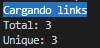

##### `--stats --validate`

También podemos combinar `--stats` y `--validate` para obtener estadísticas que
necesiten de los resultados de la validación.

```sh
$ md-links demo.md --stats --validate
```
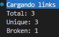

## 7. Resultado test

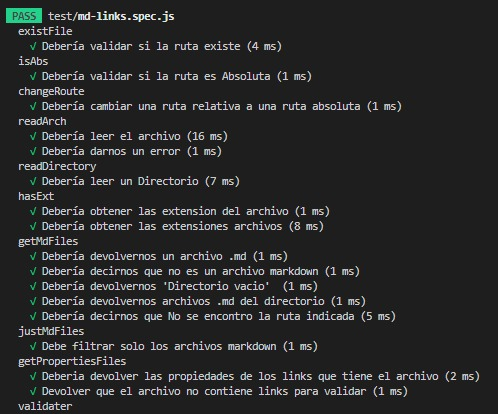
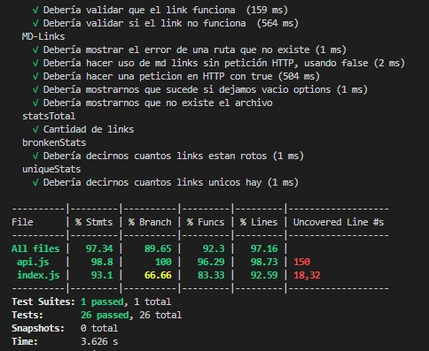

## 8.Guia de instalación

**Para instalar el proyecto se debe colocar lo siguiente en la terminal:**

 `npm install alissasalazar/DEV004-md-links`

## 9. Checklist

### General

* [x] Puede instalarse via `npm install --global <github-user>/md-links`

### `README.md`

* [x] Un board con el backlog para la implementación de la librería.
* [x] Documentación técnica de la librería.
* [x] Guía de uso e instalación de la librería

### API `mdLinks(path, opts)`

* [x] El módulo exporta una función con la interfaz (API) esperada.
* [x] Implementa soporte para archivo individual
* [x] Implementa soporte para directorios
* [x] Implementa `options.validate`

### CLI

* [x] Expone ejecutable `md-links` en el path (configurado en `package.json`)
* [x] Se ejecuta sin errores / output esperado
* [x] Implementa `--validate`
* [x] Implementa `--stats`

### Pruebas / tests

* [x] Pruebas unitarias cubren un mínimo del 70% de statements, functions,
  lines, y branches.
* [x] Pasa tests (y linters) (`npm test`).

